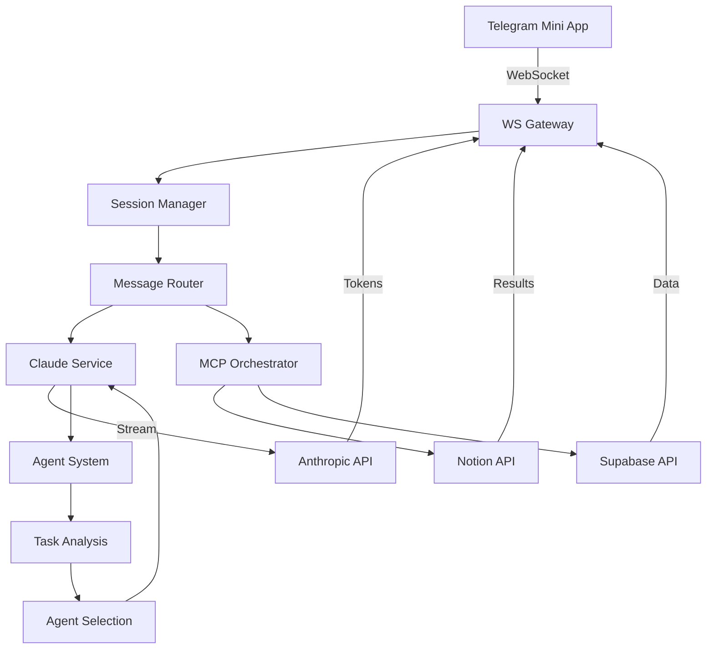

# SPARC Framework Implementation for ClaudeBROSDK

## Project Overview
ClaudeBROSDK is a Telegram Mini App that provides direct chat access to CBO BRO (Claude Sonnet 4) with integrated MCP tools, streaming capabilities, and business optimization through the BroVerse Biz Mental Model™ (BBMM).

---

## PHASE 1: SPECIFICATION (Requirements & Design)

### 1.1 Functional Requirements

#### Core Features
- **Real-time Chat Interface**: WebSocket-based bidirectional communication
- **Streaming Responses**: Token-by-token streaming using MessageStream API
- **MCP Tool Integration**: Notion and Supabase tools with permission system
- **Mode Switching**: Analyze, Create, Research, Optimize modes
- **Session Management**: Conversation context preservation
- **Agent System**: Intelligent task delegation to specialized agents

#### User Interactions
- Single input bar for all interactions
- Real-time typing indicators
- Message history with search
- File attachments support
- Voice input capability
- Quick action suggestions

### 1.2 Non-Functional Requirements

#### Performance
- Response latency < 200ms for first token
- Support 100+ concurrent users
- Message streaming at 30+ tokens/second
- Auto-reconnection within 3 seconds

#### Security
- API key encryption at rest
- WSS (WebSocket Secure) only
- Rate limiting per user
- Permission-based tool access
- Session timeout after 1 hour

#### Scalability
- Horizontal scaling ready
- Redis session storage
- CDN for static assets
- Database connection pooling

### 1.3 UI/UX Guidelines

#### Design Principles
- **Zen Minimalism**: Clean, uncluttered interface
- **Breathing Room**: Generous spacing
- **Visual Hierarchy**: Clear information architecture
- **Subtle Sophistication**: Refined interactions
- **Progressive Disclosure**: Complexity on demand

#### Color System
```css
--cbo-primary: #30D158;
--cbo-secondary: #00C851;
--bg-primary: #0D1117;
--bg-secondary: #161B22;
--text-primary: #FFFFFF;
```

### 1.4 Data Models

#### Message Schema
```typescript
interface Message {
  id: string;
  role: 'user' | 'assistant' | 'system';
  content: string;
  timestamp: Date;
  metadata?: {
    mode?: string;
    tools?: string[];
    tokens?: number;
  };
}
```

#### Session Schema
```typescript
interface Session {
  id: string;
  userId: string;
  messages: Message[];
  context: {
    mode: 'analyze' | 'create' | 'research' | 'optimize';
    activeTools: string[];
    preferences: Record<string, any>;
  };
  createdAt: Date;
  lastActivity: Date;
}
```

---

## PHASE 2: PSEUDOCODE (Logic & Algorithms)

### 2.1 WebSocket Communication Layer

```javascript
// WebSocket Message Protocol
class WSProtocol {
  // Client -> Server
  MESSAGE_TYPES = {
    CHAT: 'chat',
    TOOL: 'tool',
    MODE: 'mode',
    PING: 'ping'
  }
  
  // Server -> Client
  STREAM_EVENTS = {
    START: 'stream.start',
    CHUNK: 'stream.chunk',
    END: 'stream.end',
    ERROR: 'stream.error',
    TOOL_USE: 'tool.use',
    TOOL_RESULT: 'tool.result'
  }
  
  handleMessage(ws, message) {
    switch(message.type) {
      case CHAT:
        processWithClaude(message)
        streamResponse(ws)
      case TOOL:
        validatePermission(message.tool)
        executeTool(message)
        sendResult(ws)
    }
  }
}
```

### 2.2 Message Streaming Algorithm

```javascript
// Streaming Handler
async function streamMessage(prompt, ws) {
  // Initialize Anthropic stream
  stream = anthropic.messages.stream({
    model: 'claude-3-5-sonnet-20241022',
    messages: [{ role: 'user', content: prompt }],
    max_tokens: 1024,
    stream: true
  })
  
  // Send start event
  ws.send({ type: 'stream.start', id: generateId() })
  
  // Stream chunks
  stream.on('text', (chunk) => {
    ws.send({ 
      type: 'stream.chunk', 
      content: chunk,
      timestamp: Date.now()
    })
  })
  
  // Handle completion
  stream.on('end', async () => {
    finalMessage = await stream.finalMessage()
    ws.send({ 
      type: 'stream.end', 
      message: finalMessage,
      usage: stream.usage
    })
  })
  
  // Error handling
  stream.on('error', (error) => {
    ws.send({ type: 'stream.error', error: error.message })
  })
}
```

### 2.3 MCP Tool Orchestration

```javascript
// Tool Execution Pipeline
class ToolOrchestrator {
  async execute(toolName, params, context) {
    // Check permissions
    if (!hasPermission(context.user, toolName)) {
      throw new PermissionError()
    }
    
    // Route to appropriate MCP
    switch(toolName) {
      case 'notion.search':
        return await notionMCP.search(params)
      case 'supabase.query':
        return await supabaseMCP.query(params)
    }
    
    // Format and cache result
    result = formatToolResult(rawResult)
    cache.set(toolKey, result, TTL)
    return result
  }
}
```

### 2.4 Agent Delegation Logic

```javascript
// Agent Selection Algorithm
class AgentRouter {
  selectAgent(task, context) {
    // Analyze task intent
    intent = analyzeIntent(task)
    
    // Score agents
    scores = {}
    for (agent of availableAgents) {
      scores[agent] = agent.scoreTask(task, intent, context)
    }
    
    // Select best agent
    bestAgent = maxBy(scores)
    
    // Delegate with context
    return bestAgent.execute(task, {
      ...context,
      parentAgent: this,
      intent: intent
    })
  }
}
```

---

## PHASE 3: ARCHITECTURE (System Design)

### 3.1 Component Architecture

```
ClaudeBROSDK/
├── server/                    # Backend Service
│   ├── index.js              # Express + WS server
│   ├── websocket/            # WebSocket handlers
│   │   ├── handler.js        # Message routing
│   │   ├── protocol.js       # Protocol definitions
│   │   └── sessions.js       # Session management
│   ├── services/             # Core services
│   │   ├── claude.js         # Anthropic SDK integration
│   │   ├── streaming.js      # MessageStream handler
│   │   └── cache.js          # Response caching
│   ├── mcp/                  # MCP integrations
│   │   ├── notion.js         # Notion wrapper
│   │   ├── supabase.js       # Supabase wrapper
│   │   └── permissions.js    # Tool permissions
│   └── agents/               # Agent system
│       ├── base.js           # Base agent class
│       ├── analyst.js        # Analysis agent
│       ├── strategist.js     # Strategy agent
│       └── router.js         # Agent router
│
├── src/                       # Frontend
│   ├── index.html            # Main app
│   ├── css/                  # Styles
│   │   ├── main.css          # Core styles
│   │   ├── chat.css          # Chat interface
│   │   └── telegram.css      # Telegram integration
│   ├── js/                   # JavaScript
│   │   ├── app.js            # Main application
│   │   ├── websocket.js      # WS client
│   │   ├── streaming.js      # Stream handler
│   │   ├── ui.js             # UI controllers
│   │   └── telegram.js       # Telegram API
│   └── assets/               # Static assets
│       └── avatars/          # Agent avatars
│
├── deploy/                    # Deployment
│   ├── digitalocean.yaml     # DO App Platform
│   ├── docker-compose.yml    # Local development
│   └── nginx.conf            # Reverse proxy
│
└── docs/                      # Documentation
    ├── SPARC-IMPLEMENTATION.md
    ├── API.md
    ├── DEPLOYMENT.md
    └── TROUBLESHOOTING.md
```

### 3.2 Data Flow Architecture



### 3.3 WebSocket Protocol Specification

#### Client Messages
```typescript
// Chat message
{
  type: 'chat',
  content: string,
  mode?: 'analyze' | 'create' | 'research' | 'optimize',
  sessionId: string,
  timestamp: number
}

// Tool request
{
  type: 'tool',
  tool: string,
  params: object,
  sessionId: string
}

// Mode change
{
  type: 'mode',
  mode: string,
  sessionId: string
}
```

#### Server Events
```typescript
// Stream start
{
  type: 'stream.start',
  messageId: string,
  mode: string
}

// Stream chunk
{
  type: 'stream.chunk',
  content: string,
  messageId: string
}

// Stream end
{
  type: 'stream.end',
  message: object,
  usage: { input_tokens: number, output_tokens: number }
}

// Tool execution
{
  type: 'tool.use',
  tool: string,
  status: 'pending' | 'executing' | 'complete'
}
```

---

## PHASE 4: REFINEMENT (Optimization Cycles)

### 4.1 Performance Optimizations

#### Streaming Optimization
- Implement token buffering for smooth display
- Add chunk aggregation for network efficiency
- Use compression for WebSocket messages
- Implement adaptive streaming rate

#### Caching Strategy
- Cache frequent queries with Redis
- Implement smart cache invalidation
- Store tool results for 5 minutes
- Cache user preferences locally

### 4.2 Error Handling

#### Retry Logic
```javascript
class RetryHandler {
  async execute(fn, options = {}) {
    const maxRetries = options.maxRetries || 3
    const backoff = options.backoff || 1000
    
    for (let i = 0; i < maxRetries; i++) {
      try {
        return await fn()
      } catch (error) {
        if (i === maxRetries - 1) throw error
        await sleep(backoff * Math.pow(2, i))
      }
    }
  }
}
```

#### Fallback Mechanisms
- Graceful degradation for tool failures
- Offline mode with cached responses
- Alternative models for rate limits
- Circuit breaker for API failures

### 4.3 Security Enhancements

#### Permission System
```javascript
class PermissionManager {
  permissions = {
    'notion.read': { default: true, confirm: false },
    'notion.write': { default: false, confirm: true },
    'supabase.read': { default: true, confirm: false },
    'supabase.write': { default: false, confirm: true }
  }
  
  async checkPermission(user, tool, action) {
    const key = `${tool}.${action}`
    const perm = this.permissions[key]
    
    if (!perm) return false
    if (perm.confirm) {
      return await getUserConfirmation(user, key)
    }
    return perm.default
  }
}
```

---

## PHASE 5: COMPLETION (Production Ready)

### 5.1 Production Checklist

#### Backend
- [ ] Environment variables configured
- [ ] API key rotation implemented
- [ ] Rate limiting per user
- [ ] Error tracking with Sentry
- [ ] Health check endpoints
- [ ] Graceful shutdown handling
- [ ] Database migrations ready
- [ ] Logging with Winston

#### Frontend
- [ ] PWA manifest configured
- [ ] Service worker for offline
- [ ] Asset optimization (minify/bundle)
- [ ] Lazy loading implemented
- [ ] Error boundaries added
- [ ] Analytics integration
- [ ] A/B testing framework

#### Infrastructure
- [ ] DigitalOcean App Platform configured
- [ ] Redis for session storage
- [ ] CloudFlare CDN setup
- [ ] SSL certificates configured
- [ ] Monitoring with Datadog
- [ ] Backup strategy implemented
- [ ] CI/CD pipeline ready

### 5.2 Deployment Configuration

#### DigitalOcean App Platform
```yaml
name: claudebrosdk
region: nyc
services:
  - name: backend
    github:
      repo: digitaldavinci/claudebrosdk
      branch: main
      deploy_on_push: true
    source_dir: /server
    environment_slug: node-js
    instance_size: professional-xs
    instance_count: 2
    http_port: 8080
    envs:
      - key: ANTHROPIC_API_KEY
        scope: RUN_TIME
        type: SECRET
      - key: REDIS_URL
        scope: RUN_TIME
        value: ${redis.DATABASE_URL}
      
  - name: frontend
    github:
      repo: digitaldavinci/claudebrosdk
      branch: main
    source_dir: /src
    environment_slug: static
    routes:
      - path: /
    
databases:
  - name: redis
    engine: REDIS
    version: "7"
    size: db-s-1vcpu-1gb
    num_nodes: 1
```

### 5.3 Monitoring & Analytics

#### Key Metrics
- Response time (p50, p95, p99)
- Token usage per user
- Tool execution success rate
- WebSocket connection stability
- Error rate by type
- User engagement metrics

#### Alerts
- API rate limit approaching
- High error rate (> 1%)
- Slow response time (> 2s)
- Memory usage > 80%
- Failed tool executions
- WebSocket disconnection spike

---

## Implementation Timeline

### Week 1-2: Foundation
- Setup project structure
- Configure Anthropic SDK
- Implement basic WebSocket server
- Create streaming handler

### Week 3-4: Core Features
- Build chat interface
- Implement streaming UI
- Add MCP tool integration
- Create permission system

### Week 5-6: Agent System
- Develop base agent class
- Create specialized agents
- Implement routing logic
- Add context management

### Week 7-8: Refinement
- Performance optimization
- Error handling
- Security enhancements
- Testing & debugging

### Week 9-10: Production
- Deploy to DigitalOcean
- Configure monitoring
- Load testing
- Documentation

### Week 11-12: Launch
- Beta testing
- Bug fixes
- Performance tuning
- Public release

---

## Next Steps

1. **Immediate Actions**
   - Clone repository structure
   - Install dependencies
   - Configure environment variables
   - Test Anthropic SDK connection

2. **Development Priorities**
   - WebSocket server implementation
   - Streaming handler
   - Basic chat UI
   - MCP tool wrapper

3. **Testing Strategy**
   - Unit tests for services
   - Integration tests for WebSocket
   - E2E tests for chat flow
   - Load testing for scaling

---

## Resources & References

- [Anthropic TypeScript SDK](https://github.com/anthropics/anthropic-sdk-typescript)
- [MessageStream API Docs](https://docs.anthropic.com/sdk/streaming)
- [WebSocket Best Practices](https://developer.mozilla.org/en-US/docs/Web/API/WebSockets_API)
- [DigitalOcean App Platform](https://docs.digitalocean.com/products/app-platform/)
- [MCP Protocol Spec](https://modelcontextprotocol.io)

---

## Contact & Support

- **Project Lead**: Digital DaVinci
- **Repository**: github.com/digitaldavinci/claudebrosdk
- **Support**: support@claudebrosdk.com
- **Documentation**: docs.claudebrosdk.com