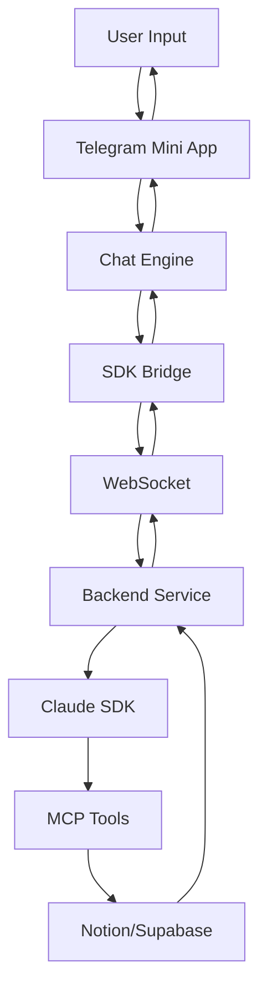

# ClaudeBROSDK Architecture

## Project Overview
ClaudeBROSDK is a Telegram Mini App that provides direct chat access to CBO BRO (Claude Sonnet 4) with integrated MCP tools, agent capabilities, and contextual efficiency through a minimalist interface.

## Core Architecture Components

### 1. Frontend (Vanilla Stack)
```
ClaudeBROSDK/
├── src/
│   ├── index.html              # Main app entry
│   ├── styles/
│   │   ├── main.css           # Core styles
│   │   ├── telegram.css       # Telegram integration
│   │   └── components.css     # UI components
│   ├── scripts/
│   │   ├── app.js             # Main application logic
│   │   ├── chat-engine.js    # Chat management
│   │   ├── sdk-bridge.js     # Claude SDK bridge
│   │   ├── mcp-manager.js    # MCP tool orchestration
│   │   └── telegram-api.js   # Telegram WebApp API
│   └── assets/
│       └── avatars/           # Agent avatars
```

### 2. Claude SDK Integration Layer

#### Browser Bridge Pattern
Since Claude Code SDK is Node.js-based, we implement a bridge pattern:

```javascript
// sdk-bridge.js - WebSocket connection to backend
class ClaudeSDKBridge {
  constructor() {
    this.ws = new WebSocket('wss://api.yourdomain.com/claude');
    this.sessionId = null;
    this.messageQueue = [];
  }
  
  async query(prompt, options = {}) {
    return this.sendMessage({
      type: 'query',
      prompt,
      model: options.model || 'sonnet',
      tools: options.tools,
      context: options.context
    });
  }
}
```

### 3. Backend Service (Node.js)

```javascript
// server/index.js
import { claude } from '@instantlyeasy/claude-code-sdk-ts';
import { WebSocketServer } from 'ws';

const wss = new WebSocketServer({ port: 8080 });

wss.on('connection', (ws) => {
  const session = claude()
    .withModel('sonnet')
    .allowTools('Read', 'Write', 'mcp__notion__*', 'mcp__supabase__*')
    .skipPermissions();
    
  ws.on('message', async (data) => {
    const { type, prompt, tools } = JSON.parse(data);
    
    if (type === 'query') {
      const response = await session
        .query(prompt)
        .asText();
      
      ws.send(JSON.stringify({ type: 'response', data: response }));
    }
  });
});
```

### 4. MCP Tool Integration

#### Notion MCP
```javascript
// mcp-integrations/notion.js
class NotionMCP {
  constructor(bridge) {
    this.bridge = bridge;
    this.tools = [
      'mcp__notion__API-post-database-query',
      'mcp__notion__API-post-search',
      'mcp__notion__API-create-a-database',
      'mcp__notion__API-post-page'
    ];
  }
  
  async searchWorkspace(query) {
    return this.bridge.query(
      `Search Notion for: ${query}`,
      { tools: this.tools }
    );
  }
}
```

#### Supabase MCP
```javascript
// mcp-integrations/supabase.js
class SupabaseMCP {
  constructor(bridge) {
    this.bridge = bridge;
    this.tools = [
      'mcp__supabase__query',
      'mcp__supabase__insert',
      'mcp__supabase__update'
    ];
  }
  
  async queryDatabase(table, filters) {
    return this.bridge.query(
      `Query ${table} with filters: ${JSON.stringify(filters)}`,
      { tools: this.tools }
    );
  }
}
```

### 5. Agent/Subagent System

```javascript
// agents/agent-manager.js
class AgentManager {
  constructor() {
    this.agents = {
      cbo: new CBOAgent(),        // Main CBO BRO
      analyst: new AnalystAgent(), // Business analysis
      strategist: new StrategistAgent(), // Strategy planning
      optimizer: new OptimizerAgent()   // Process optimization
    };
  }
  
  async delegateTask(task, context) {
    const agent = this.selectAgent(task);
    return agent.execute(task, context);
  }
}
```

### 6. UI Components

#### Chat Interface
- **Single Input Bar**: Centralized interaction point
- **Context Controls (Left)**:
  - Mode Selector (Analyze/Quick/Strategy)
  - History Browser
  - Suggestion Hints
- **Action Controls (Right)**:
  - Settings
  - File Attachment
  - Voice Input
  - Send Button

#### Capability Switching
```javascript
// ui/capability-switcher.js
class CapabilitySwitcher {
  constructor() {
    this.modes = {
      analyze: { 
        model: 'sonnet',
        tools: ['all'],
        depth: 'comprehensive'
      },
      quick: {
        model: 'sonnet',
        tools: ['limited'],
        depth: 'surface'
      },
      strategy: {
        model: 'sonnet',
        tools: ['notion', 'analysis'],
        depth: 'strategic'
      }
    };
  }
}
```

### 7. Permission & Security

```javascript
// security/permission-manager.js
class PermissionManager {
  constructor() {
    this.permissions = {
      notion: {
        read: true,
        write: false,
        delete: false
      },
      supabase: {
        read: true,
        write: true,
        delete: false
      },
      file: {
        read: true,
        write: false,
        execute: false
      }
    };
  }
  
  async requestPermission(tool, action) {
    // Show user confirmation dialog
    return await this.showPermissionDialog(tool, action);
  }
}
```

## Data Flow Architecture



## Deployment Architecture (DigitalOcean)

### App Platform Configuration
```yaml
name: claudebrosdk
services:
  - name: backend
    environment_slug: node-js
    github:
      branch: main
      deploy_on_push: true
      repo: your-repo/claudebrosdk
    source_dir: /server
    envs:
      - key: ANTHROPIC_API_KEY
        scope: RUN_TIME
        type: SECRET
      - key: NOTION_API_KEY
        scope: RUN_TIME
        type: SECRET
    http_port: 8080
    
  - name: frontend
    environment_slug: html
    github:
      branch: main
      deploy_on_push: true
      repo: your-repo/claudebrosdk
    source_dir: /src
    routes:
      - path: /
```

## Security Considerations

1. **API Key Management**: Never expose keys in frontend
2. **WebSocket Security**: WSS with authentication tokens
3. **Rate Limiting**: Implement per-user limits
4. **Permission System**: Granular tool access control
5. **Data Encryption**: End-to-end for sensitive data

## Performance Optimization

1. **Message Streaming**: Real-time token display
2. **Session Caching**: Maintain context efficiently
3. **Lazy Loading**: Load MCP tools on demand
4. **CDN Integration**: Static assets via CloudFlare
5. **Connection Pooling**: Efficient WebSocket management

## Monitoring & Analytics

1. **Usage Tracking**: Token consumption per user
2. **Error Logging**: Centralized error management
3. **Performance Metrics**: Response time tracking
4. **User Analytics**: Interaction patterns
5. **Cost Management**: API usage optimization

## Future Enhancements

1. **Voice Integration**: Speech-to-text input
2. **Multi-language Support**: i18n implementation
3. **Custom Agents**: User-defined agents
4. **Advanced Workflows**: Complex task automation
5. **Plugin System**: Extensible MCP tools